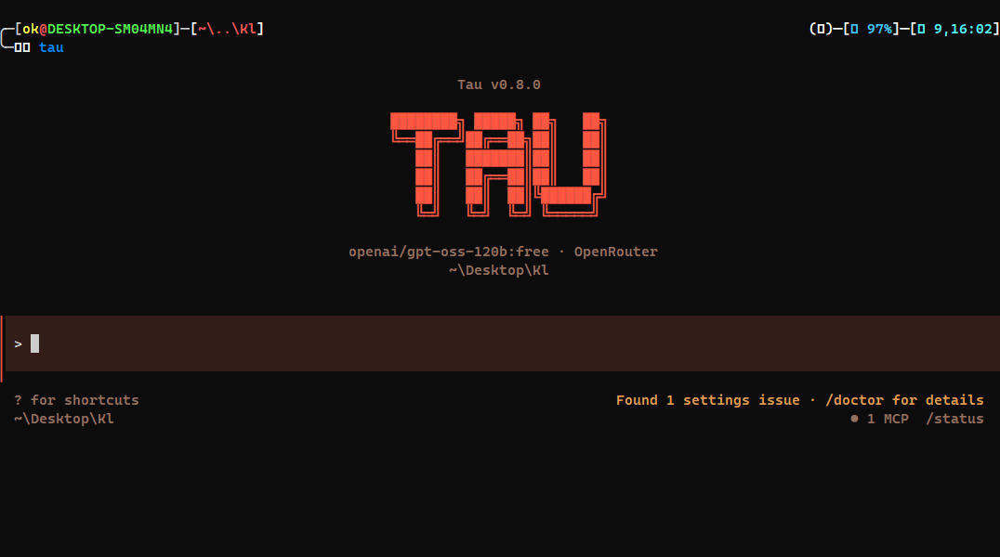

<p align="center">
  
</p>

# The True Free Claude Code

[](https://www.npmjs.com/package/@abdoknbgit/tau)
[](https://www.npmjs.com/package/@abdoknbgit/tau)
[](https://www.npmjs.com/package/@abdoknbgit/tau)

<video src="https://github.com/user-attachments/assets/27f65054-307d-4a0b-9746-cbce6480c99b" controls width="100%"></video>

---

## What is Tau?

Tau is the true free Claude Code agent. It gives you a full agentic Claude Code environment - tools, MCP servers, hooks, skills, file editing, shell execution, and session control - without locking you into one paid route.

It is not a proxy and not a wrapper around someone else's wrapper. Tau has native adapters for 18 providers, built to make them work directly inside your agentic Claude Code environment. When you use Gemini, Tau speaks Gemini's API directly. Same for OpenAI, GLM, DeepSeek, OpenRouter, AgentRouter, MiniMax, and the rest.

You install it once. You type `/login`. You pick a provider. You work.

That's it: plug and play with one command and one login flow. No shell configuration. No export statements. No environment variable archaeology. A first-run wizard handles credentials and saves them. Cross-platform — Windows, macOS, Linux.

---

## Why does this exist?

Because Anthropic rate limits are real, and sometimes you just want to say hi to your terminal without getting a 429 back.

Tau lets you swap providers mid-session. Anthropic giving you the cold shoulder? Switch to Kimi K2.6. Still need the agent loop, the file editing, the bash execution, the MCP servers, the hooks? You have all of it. Nothing changes except who's doing the thinking.

And here's the part that actually matters: you can work with any provider - Codex CLI, Gemini CLI, Antigravity, Cline, Cursor, KiloCode, Kiro, GitHub Copilot - without any of them installed on your machine. Not downloaded, not configured, not even present. Tau brings the runtime. You bring the auth most of them or API key.

That's the point. Same experience. Different brain. Zero dependencies on the original tool.

---

## Install

```bash
npm install -g @abdoknbgit/tau
```

**Requirements:** Node.js >= 20.0.0, Bash, gh for GitHub automation

---

## Launch

```bash
tau
```

Launch with skip permission mode:

```bash
tau --dangerously-skip-permissions
```

---
## Update

```bash
tau update
```

<p align="center">
  
</p>

---
## The Commands You Need to Know

### Auth

**`/login` - Start here**
Pick a provider, enter your credentials, and Tau saves the setup. No env variables, no config hunt.

### Models

**`/models` - Pick your model**
Live model browser. Fetches the real catalog from your provider API, lets you search, filter, and set the active model.

```
/models                     open the full picker
/models <query>             search active provider
/models openrouter:kimi     search a specific provider
/model kimi-k2-5            set a model directly
```

### Voice

**`/hey` - Start a voice conversation**
Turns on voice conversation mode. Hold Space to talk, release to send, and Tau shows what it heard before submitting.

**`/bye` - End the voice conversation**
Turns voice conversation mode off and stops any spoken reply that is still playing.

### Session

**`/tree` - Navigate the session graph**
Move through your conversation history like nodes, so branches and forks stay understandable.

**`/clone` - Clone the session**
Create a copy of the current session when you want a backup or a clean duplicate to continue from.

**`/branch` - Open a fork**
Start a fork from the current point in the session without losing the original path.

**`/resume` - Continue later**
Resume the last useful session or pick an older one when you want to continue where you left off.

### Monitoring and Reporting

**`/usage` - Watch provider usage**
Shows real streaming provider usage as it happens, so you can see provider consumption while working.

**`/statistics` - Review the current session**
Shows statistics for the active session, including session activity and tool-call details.

**`/report` - Generate a final report**
Creates a clean content report for the session in Markdown, PDF, or HTML. This is for readable session quality, not usage statistics.

### Features

**`/fallback` - Recover automatically**
Automatic recovery when a model fails mid-session. Configure a fallback and keep working through provider outages.

**`/dangerously-skip-permissions` - Skip permission prompts in a trusted sandbox**
Session-only Bypass Permissions mode. Tau shows a warning before enabling it, permission prompts include the same session option, and `/dangerously-skip-permissions off` returns to Default mode.

Launch Tau directly in this mode:

```bash
tau --dangerously-skip-permissions
```

**`/github` - GitHub automation (gh required)**
GitHub workflows inside Tau, powered by the GitHub CLI.

- `issue` - Inspect issues for the current repo, or pass an issue URL to inspect that issue.
- `pr` - Inspect pull requests (repo-local or via PR URL) and generate gh-backed actions.
- `wrap` - Stage → commit → (optional changelog) → push, with one permission gate before network writes.
- `changelog` - Generate/update changelog notes from commit history in a consistent style.
- `triage` - Classify issues (labels/status) with explicit confirmation before visible changes.
- `release` - Release flow: inspect dirty working tree, check CI/CD workflow status, then tag/publish and list runs.

**`/safetest` - Run a file inside a disposable cloud sandbox**
Upload one file to a fresh E2B VM, run it there, get a clean report back. The local machine never executes anything. Each run gets its own throwaway sandbox that's destroyed at the end.

Setup is one step: `/login` → **E2B Security** → pick "Auth login" (opens the E2B dashboard in your browser) or "API key" (just paste). After that, `/safetest` is ready — no env variables, no extra config.

**Templates (the sandbox image used for the run):**

| Built-in (work right after login) | What it's for |
|---|---|
| `auto` | The default. Looks at the file extension and a quick scan of imports, then picks the right template. |
| `base` | Minimal Linux. Bash, sh, zsh, unknown plain files. |
| `code` | Code-interpreter (Python + Node + Jupyter). The default for normal scripts. |
| `desktop` | E2B's official desktop image — Xvfb + a real display. Used automatically when the script imports a GUI library (tkinter, PyQt, PySide, wx, pygame, selenium, playwright, pyautogui, electron, puppeteer). |
| `mcp` | mcp-gateway, for MCP workflow files. |

| Optional (require a custom E2B template you build with `e2b template build`) | What it's for |
|---|---|
| `wine`, `windows`, `windows-analysis` | Detonating `.exe`, `.bat`, `.cmd` under Wine. |
| `powershell` | `.ps1` / `.psm1` with pwsh installed. |
| `browser` | `.html`, `.svg` for DOM behavior checks. |
| `security` | Static triage tools — strings, exiftool, yara, binwalk. |
| `network` | Controlled phone-home testing (used together with `--allow-internet`). |

**File types it runs out of the box:**

- **Scripts that just work:** `.sh`, `.bash`, `.py`, `.pyw`, `.ipynb`, `.js`, `.mjs`, `.cjs`, `.ts`, `.tsx`, `.rb`, `.pl`, `.php`, `.lua`, `.jar` — auto-routed to `code` or `desktop`, including a virtual display when needed.
- **Shell variants** (`.zsh`, `.fish`) and **PowerShell** (`.ps1`) run when the chosen template ships those interpreters; otherwise you get a clear "runtime not installed in this template" message instead of a crash.
- **Linux native binaries** (ELF / Mach-O / executables) — chmod'd and run directly under the chosen template.

**File types that get static analysis instead of execution:**

- **Windows binaries** (`.exe`, `.dll`, `.msi`, `.scr`, `.com`, `.bat`, `.cmd`) — there is no public E2B template with Wine, so by default `/safetest` reports a comprehensive static analysis (file type, sha256/md5, exiftool metadata, objdump headers, imports/DLL deps, filtered strings: URLs, registry keys, common Win32 / network APIs) without ever executing the binary. To actually detonate one, you'd need to build a custom Wine template and run `/safetest wine @./<file>`.
- **Documents and archives** (`.pdf`, `.docx`, `.xlsx`, `.zip`, `.iso`, `.apk`, etc.) — same rule: static analysis only, unless you've configured a `security` / `document` template.

**Edge cases worth knowing about:**

- **No login yet.** `/safetest` tells you exactly what to do (`/login` → E2B Security) instead of erroring. After login, it just works.
- **Headless display gotchas.** GUI scripts get an automatic virtual display. The shell tries `xvfb-run` first, falls back to a raw `Xvfb :99` server when the template ships Xvfb but no `xauth`, and emits a specific hint if both are missing telling you which packages to add.
- **Network is off by default.** Add `--allow-internet` if your script needs network access in the sandbox.
- **The "Account Checker" / suspect-binary case.** If a file looks like a credential-abuse tool, `/safetest` won't pretend it can detonate it — you get the static report and that's it. The whole point of the sandbox is safe inspection, not normalising execution of arbitrary attack tools.
- **Placeholder template IDs.** If `safetest.config.json` still has `<paste-the-id-from-e2b-template-build>` (or other placeholder strings) instead of a real template ID, `/safetest` refuses to start with a clear error pointing at the config file — no more "no such file or directory" mystery.
- **File size guard.** Files above 10 MB are rejected before upload; raise it explicitly with `--max-file-bytes` when you really mean it.
- **Disposable sandbox.** Every run creates a fresh VM and kills it at the end. Output includes the sandbox ID so you can verify it.

---

## Supported Providers

| Provider | Notes |
|---|---|
| Anthropic | No comment |
| OpenAI | Best in class, but GPT-5.5 is paywalled behind Plus/Pro |
| Google Gemini | Use your own account — some server configs block certain regions-currently gemini servers are not working and giving some error 429 u can check here https://github.com/google-gemini/gemini-cli/issues |
| Antigravity | Saving lives from agent server overload errors |
| OpenRouter | Would use this full-time if the bills didn't care |
| Moonshot AI | Direct Kimi models through Moonshot's OpenAI-compatible API, including Kimi K2.6 for coding work |
| MiniMax AI | Direct MiniMax M2 models through MiniMax's OpenAI-compatible API, with saved API-key login, live model browsing, and Token Plan usage checks |
| NVIDIA NIM | Gets slow under server load, especially for newest models like Kimi K2 |
| DeepSeek | Solid |
| GLM / BigModel | Works with your BigModel plan or the small amount of free credit they give you |
| Ollama | Local and private, but you knew that already |
| Cline | Moonshot AI's Kimi K2.6 through here is still the big win. Note: the old free tier is no longer fully free, but you still get some free credit |
| GitHub Copilot | Recommended for enterprise plans; free models are also usable for lighter work |
| Cursor | Peak performance on Plan mode |
| KiloCode | Lots of free models and decent to try for low-cost side tasks |
| Kiro | Best performance/cost provider with large free credit |
| AgentRouter | Includes free $125 usage. Latency is server-side, and the API still has issues. claude_haiku is currently the only model I made work well. For AgentRouter only, Windows is currently supported; Linux and macOS support is being worked on |

---

## Features

**Multi-provider, natively**
18 providers with native adapters. Not a routing layer, not a translation proxy — each provider speaks its own API through its own adapter. Full streaming, rate-limit handling, and automatic tool schema sanitization per provider.

**The full agent loop**
File editing, bash execution, glob, grep, web search, web fetch, MCP servers, hooks (PreToolUse, PostToolUse, UserPromptSubmit, Stop, Notification), skills (/commit, /review-pr, /simplify), and task management — all present, all working across every provider.

**Voice conversation**
Use `/hey` to start a voice conversation and `/bye` to end it. Tau can listen, transcribe what you said, send it as your prompt, and optionally speak replies back.

**GitHub automation and repo management**
The `/github` command brings common GitHub work into Tau through `gh`: inspect issues and pull requests, review repo state, triage labels/status, generate changelog notes, run wrap-up flows for stage/commit/push, and inspect workflow or release status before publishing changes.

**Scalable context across providers**
Tau adapts context windows when switching between models and providers, so larger-context models can carry more history while smaller-context models stay usable.

**Fallback recovery**
A configurable fallback system can move work to another model/provider when the current one fails or overloads.

**Session management and flexibility**
Tree navigation, cloning, branching, and resume commands make long sessions easier to control without losing context.

**High-visibility monitoring and reporting**
Tau separates live usage, session statistics, and final reports, so you can monitor consumption while still producing readable end-of-session summaries.

---

## Coming Soon

**`/surf`** - Intelligent model routing. Tau reads the task and routes to the best available model automatically. Experimental, in progress.

**`tau-vscode`** - VS Code extension. Provider switching from the command palette, Control Center webview, and project-aware session launch. In progress.

---

## License

MIT
