<p align="center">
  
</p>

# Tau - Your Adaptive Coding Agent

[](https://www.npmjs.com/package/@abdoknbgit/tau)
[](https://www.npmjs.com/package/@abdoknbgit/tau)
[](https://www.npmjs.com/package/@abdoknbgit/tau)

---

## What is Tau?

Tau is an adaptive coding harness that is simple to use. It costs less to run, gives you higher quality output, and lets you follow what the agent is doing with better monitoring and visuals. You don't have to go hunting for tools and plugins, because Tau brings the ecosystem to you: prebuilt integrations that cover most of your use cases, ready from the first run. Getting started is plug and play. Install it, type `/login`, pick a provider, and start working. Tau has native adapters for 28 providers, so it talks to each provider API directly with no proxy in between. The full list is in [PROVIDERS.md](PROVIDERS.md).

---

## Install

```bash
npx -y @abdoknbgit/tau-installer@latest
```

**Requirements:** Node.js 20.19+ or 22.12+ (require(esm) support), Git, Bash, `gh` for GitHub automation, and Go 1.25.8+ to build the optional native Tau helpers from source.

---

## Launch

```bash
tau
```

Launch with skip permission mode:

```bash
tau --dangerously-skip-permissions
```

---

## Update

```bash
tau update
```

See what changed in each version in **[CHANGELOG.md](CHANGELOG.md)**.

<p align="center">
  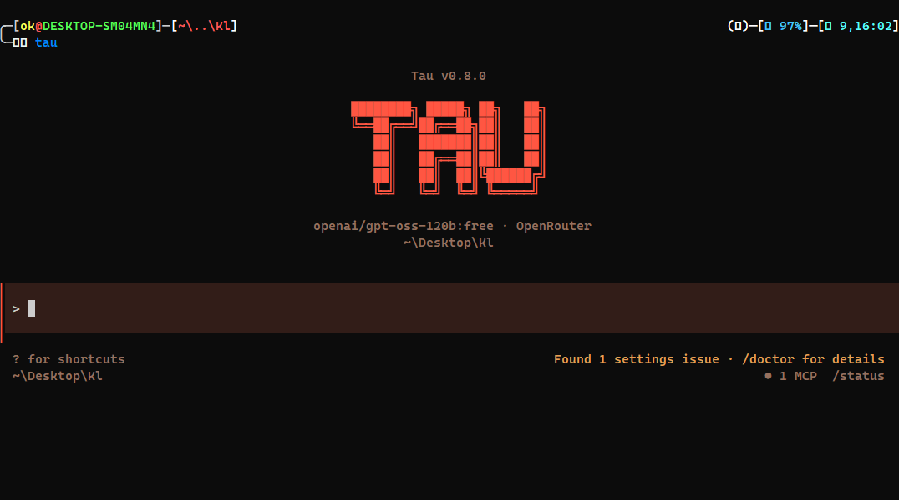
</p>

## Commands

**`/models`** - Browse available models and switch the active model.

**`/tools`** - Toggle the optional tools available in normal mode.

**`/mode cheap`** - Use a compact, cache-stable core with bounded tool output. **`/mode normal`** - Use your configured tools.

See the full command list and usage notes in **[COMMANDS.md](COMMANDS.md)**.

---

## Supported Providers

28 providers with native adapters. See the full list and per-provider notes in **[PROVIDERS.md](PROVIDERS.md)**.

---

## Features

### Multi-provider, natively

28 providers with native adapters. Not a routing layer, not a translation proxy. Each provider speaks its own API through its own adapter. Full streaming, rate-limit handling, and automatic tool-schema sanitization per provider.

### The full agent loop

Everything a full agent loop needs is built in: tools, skills, subagents, MCP servers, LSP and hooks. It all works the same way with every provider.

<p align="center">
  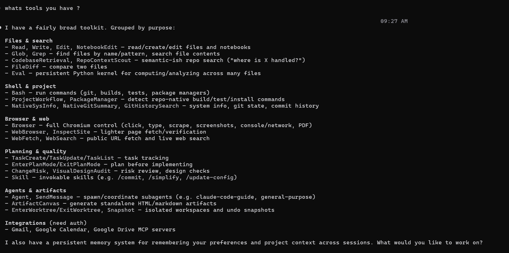
</p>

### Optimized tools

We put work into every tool so it does its job as well as possible. Search is a good example. Most agents give the model a basic search tool. Tau uses the latest ripgrep with signal fetch and native indexing, so queries are fast, the results are better, and large outputs are saved so the agent can come back to them without searching again. It also respects `.gitignore` in folders that are not git repos yet, so `node_modules` and build output stay out of your results.

Reading files got the same treatment. Tau reads by signal and starts from a skeleton of the file, so when it needs one function in an 800-line file, it reads those 50 lines instead of the whole file. The Bash tool follows best practices by default, and commands go through a security classifier built on a Go shell parser. All of this keeps noise out of the context window and cuts down on turns wasted by commands that fail.

### LSP native integration

Built-in Language Server Protocol support. The agent gets real diagnostics, definitions, references, and hover information from project LSPs (TypeScript, Python, Bash, YAML, and more) without spawning external editor tooling. Type errors, unused symbols, and cross-file references are first-class signal in the agent loop.

<p align="center">
  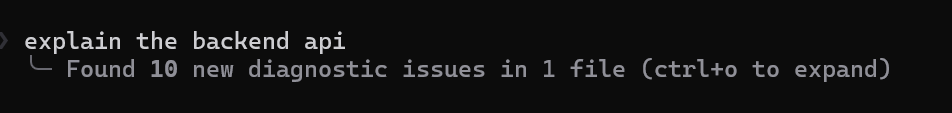
</p>

### Snapshots and time travel

Tau keeps snapshots of your working tree in a shadow git repo, separate from your project `.git`, so your branches and history are never touched. The agent can save, list, diff and restore them, which gives you real time travel: go back to how your files looked an hour ago, then return to where you were. You can also try two approaches to the same problem, snapshot each one, and keep the one you like better. And if the agent breaks something or a session crashes halfway through a task, your last good state is still there, one restore away. Files over 2 MB are skipped so the store stays small, and old snapshots are cleaned up every week.

<p align="center">
  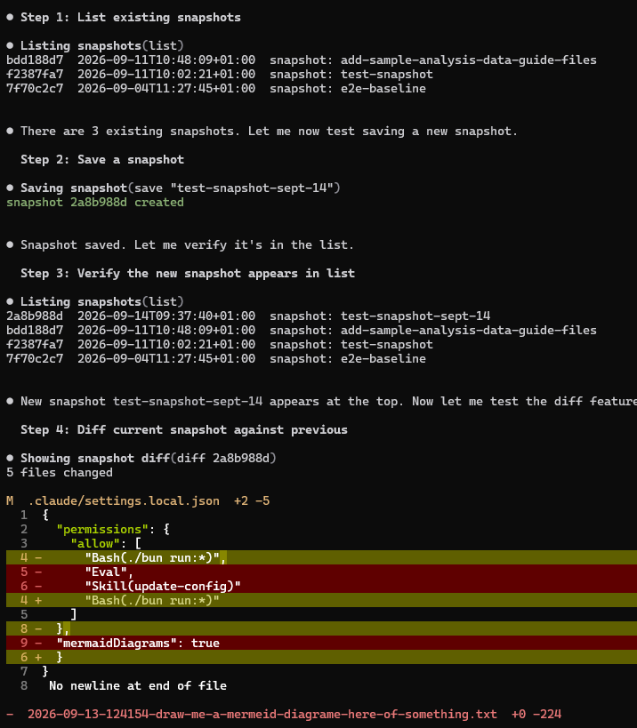
</p>

<p align="center">
  
</p>

### Web search

Web search works out of the box. Tau has a native MCP search built in as a tool, so there is no key to add and nothing to configure, and it is free with no limits. If you prefer Firecrawl, add your key through `/login`, then **Firecrawl Search**, and Tau will use the Firecrawl search backend instead. Their free plan includes 1,000 searches a month.

### Remote control and shared sessions

`/remote local` serves your session over your own Wi-Fi. It connects instantly and nothing leaves your network. `/remote global` opens a free Cloudflare HTTPS tunnel that works from anywhere, even on cellular (it needs `cloudflared`). Scan the QR code to pair, then read, prompt and approve tools from your phone while the work keeps running on your machine.

The global link is also how you work together. Share that one link and your teammates can join the session and work in it with you.

<p align="center">
  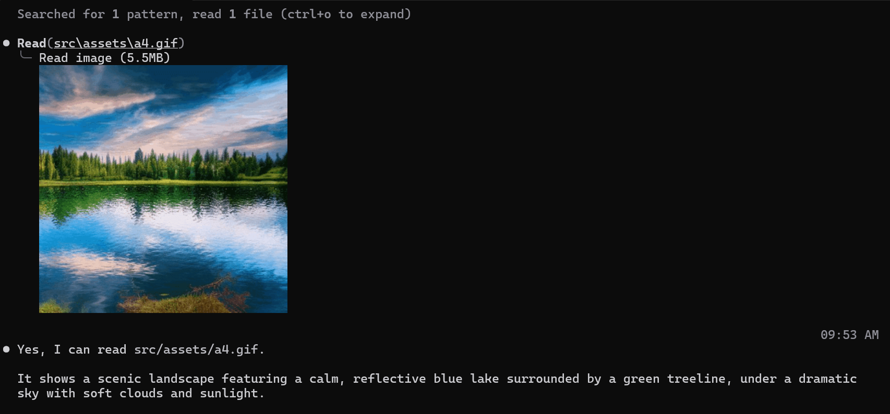
  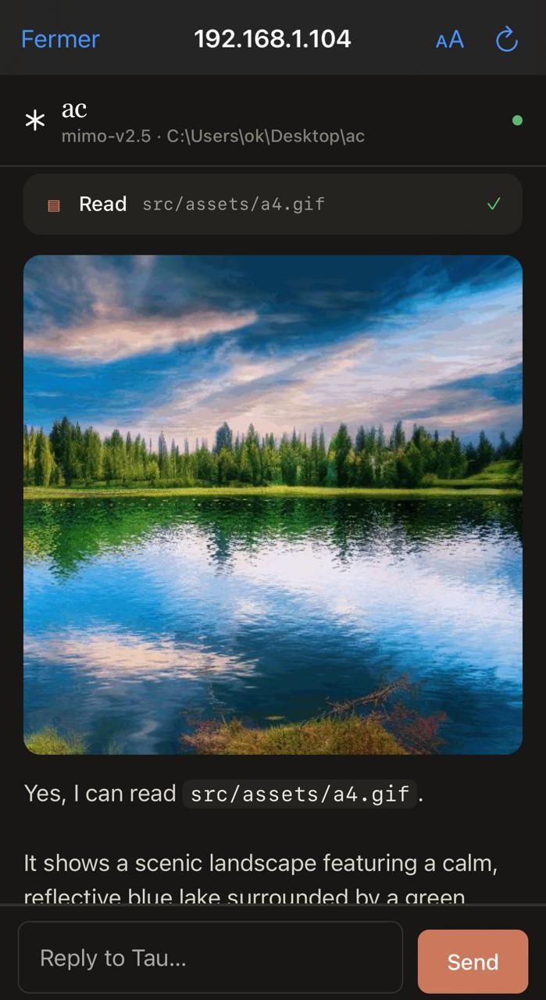
</p>

### Python kernel in the loop

This is one of the biggest reasons Tau costs less than other agents. Tau has a persistent Python kernel, so anything Python can do, Tau can do too. Say you want insights from 20 CSV files. A typical agent works through them one at a time, which easily adds up to 30 turns. Every file it reads stays in the context window, so each turn costs more than the one before, and you pay again for the turns spent fixing mistakes on the way. Tau writes the whole workflow as one Python cell, runs it in a single turn and gets back only the result. The context stays clean, the logic sits in one place so problems are easy to spot, the answer is better, and the bill is much smaller.

CSV files are only one example. The same goes for counting and ranking things across a codebase, auditing many files at once, cross-checking data, or making the same change everywhere. The kernel keeps its state between cells, can call your other Tau tools from inside the code, and draws charts right in the terminal, like this one:

<p align="center">
  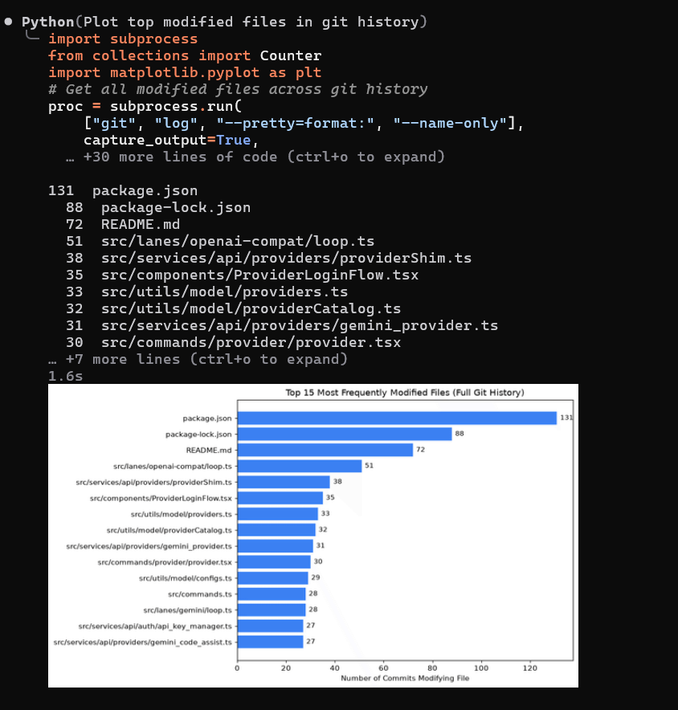
</p>

### Diagrams in the terminal

Tau would rather show you than bury you in text. For everyday tasks it reaches for a diagram first, like a flow, an architecture or a sequence of calls, drawn right in your terminal next to a short explanation. It works with any provider, and the diagrams stay in your session like the rest of the output. If you prefer plain text, turn them off in `/config`, then **Draw diagrams**.

<p align="center">
  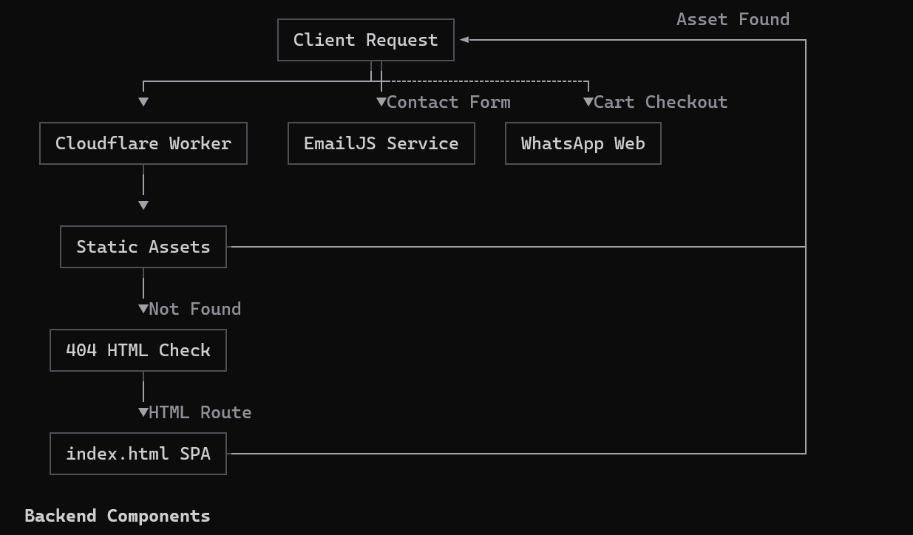
</p>

### Browser automation

Tau can do in a browser what you can do: inspect your frontend design, check your email, compare prices, book you a flight. It uses a real Chrome window with real clicks and typing, and it reads the page console and network too, so errors in the app you are building come straight back to it.

<p align="center">
  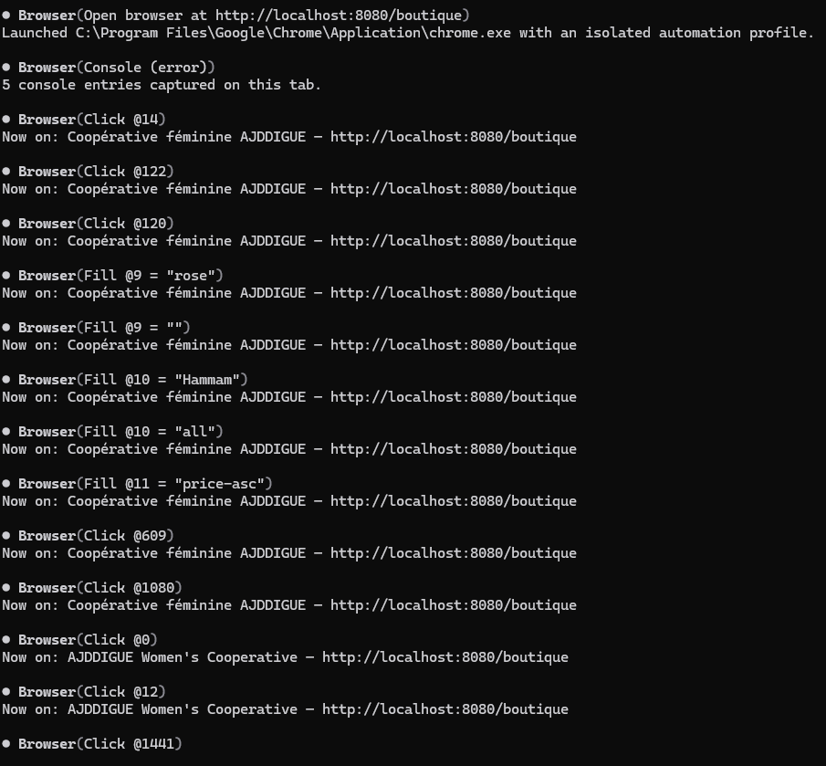
</p>

<p align="center">
  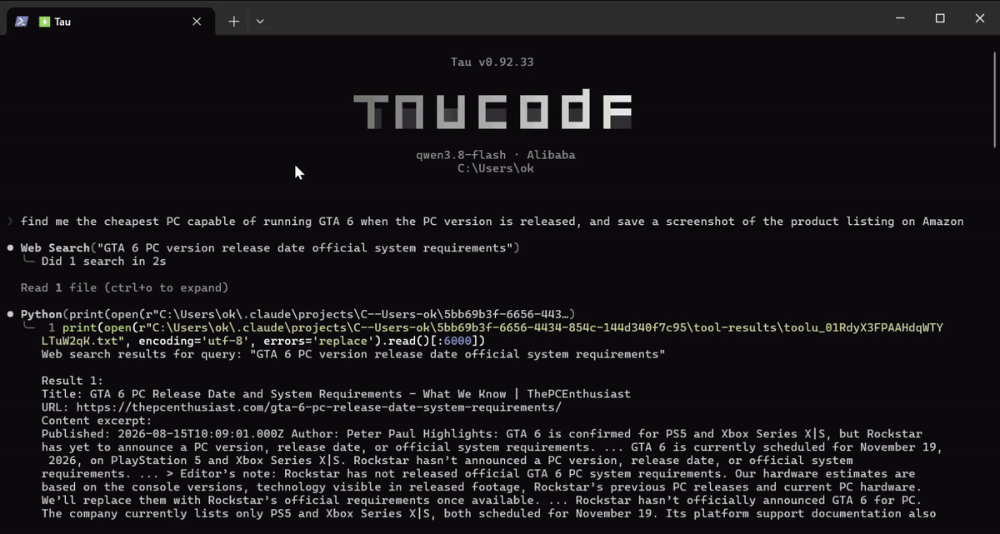
</p>

### Subagents that stay alive

In most harnesses a subagent lives a short life: it gets spawned, does its job and dies. Tau treats a subagent like a real worker. You can name it, talk to it while it works and send it new instructions. When agents run in parallel and need to edit the same file, Tau makes them take turns, so their changes never overlap. And a finished agent doesn't die. It stays alive with all the context it gathered, so you can hand it the next task instead of paying for a fresh agent to read everything again. Each agent can also run on its own provider and model. You get better orchestration, no overlapping edits and a smaller bill.

Here a named agent looks for bugs, gets a follow-up task after it has finished, and reports back with the fixes:

<p align="center">
  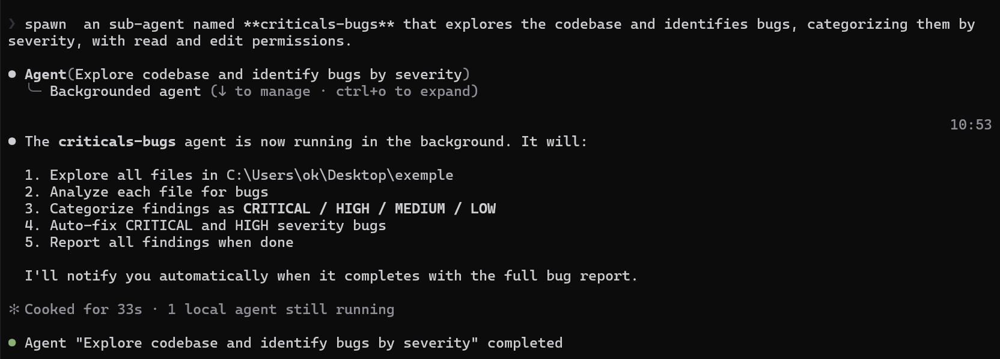
</p>

<p align="center">
  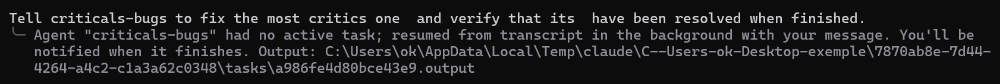
</p>

<p align="center">
  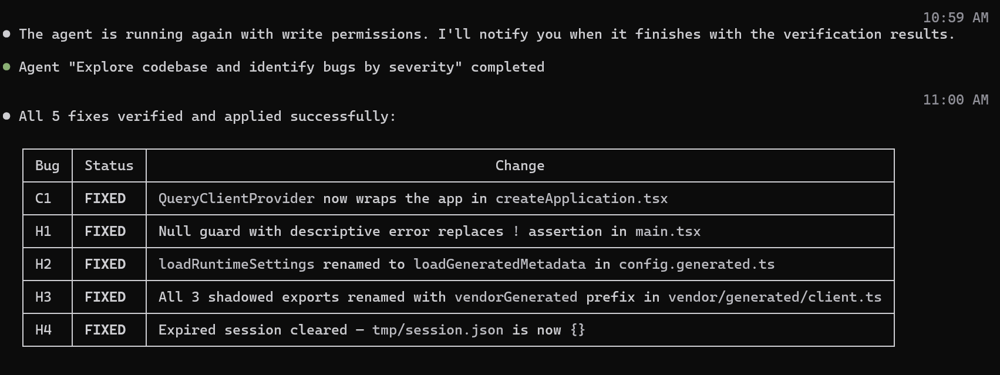
</p>

### Pay only for what you use

Tau thinks about your money and your preferences before anything else. A normal workflow doesn't need skills, agents or MCP servers, so you can leave them off and stay in cheap mode. When you need them, one command turns them on: `/mode normal`. You don't need an MCP server for things like diagrams or browser automation either, because those tools are built into Tau. Switch each of them on or off with `/tools`, so you pay less, or nothing, for what you don't use.

<p align="center">
  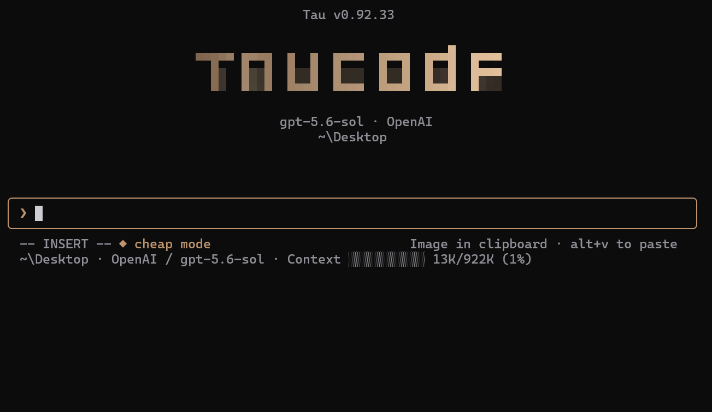
</p>

### GitHub automation and repo management

The `/github` command brings common GitHub work into Tau through `gh`: inspect issues and pull requests, review repo state, triage labels/status, generate changelog notes, run wrap-up flows for stage/commit/push, and inspect workflow or release status before publishing changes.

### Scalable context across providers

Tau adapts context windows when switching between models and providers, so larger-context models can carry more history while smaller-context models stay usable.

### Fallback recovery

A configurable fallback system can move work to another model/provider when the current one fails or overloads.

### Session management and flexibility

Tree navigation, cloning, branching, and resume commands make long sessions easier to control without losing context.

### Session info for your scripts

Commands run by Tau's Bash and PowerShell tools, including the ones you type with `!`, get `AI_AGENT=tau` and `TAU_SESSION_ID` (the id `/status` shows). When the model runs the command, it also gets `TAU_PROVIDER` and `TAU_MODEL` (a subagent reports its own), plus `TAU_EFFORT` for Anthropic, Bedrock, Vertex and Foundry models that have an effort level. Git hooks and scripts can use them to log which session and model made a change. The model never sees these values, so they cost no tokens.

### High-visibility monitoring and reporting

Tau separates live usage, session statistics, and final reports, so you can monitor consumption while still producing readable end-of-session summaries.

### Reads the rules your team already wrote

Switching from another tool? Tau reads `AGENTS.md`, Cursor `.cursor/rules/*.mdc`, Copilot `.github/instructions`, Cline, and Windsurf rules where they already sit — no migration, no conversion step.
Path-scoped rules load only when you touch a file they cover, and rules the original tool kept dormant stay dormant, so nothing bloats every request. Project files only; your global config for other tools is never read.

### Self-learning & self-improvement

Tau gets better the more you use it. After a substantial task, or on demand via `/learned`, it proposes one critical, general, reusable lesson (a framework gotcha, a whole class of bug to avoid, a hard-won constraint, or your own preference) for you to Approve / Edit / Skip. Approved lessons are saved to memory and carried from this session into future ones and other projects, so the work keeps compounding instead of starting cold. Review, edit, delete, or toggle everything it learns with `/learned`.

---

## License

MIT
